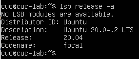
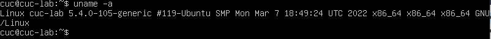
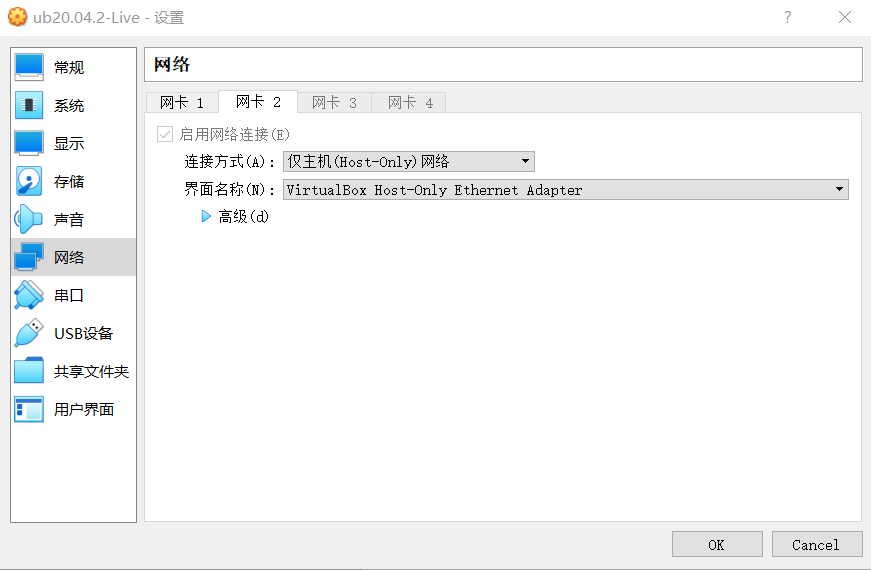
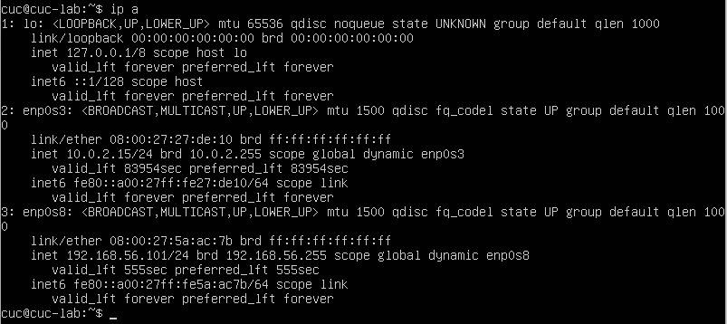
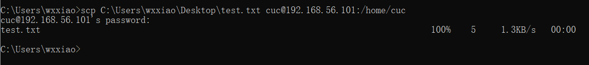
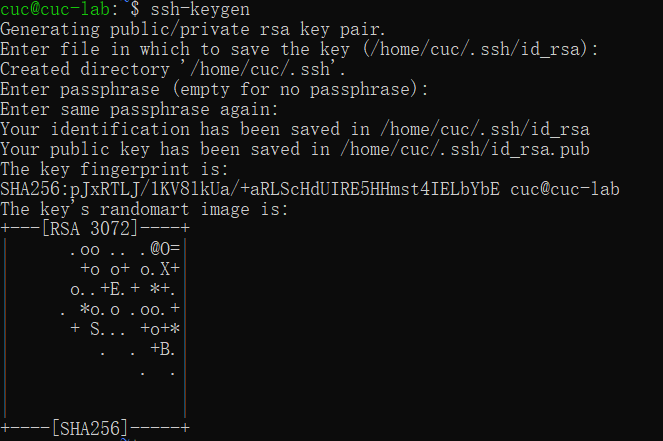
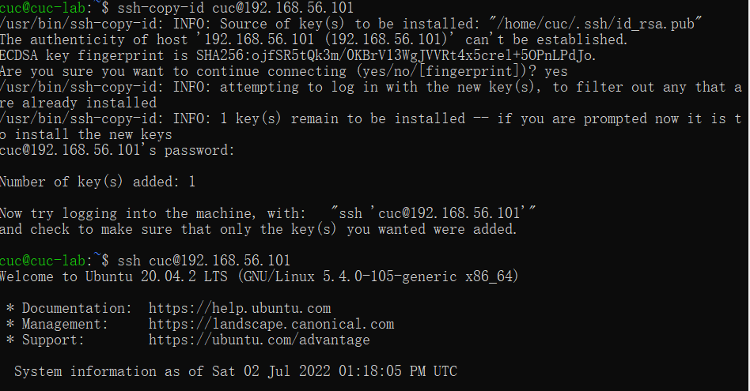

# 第一章 Linux基础（实验）

## 实验软件环境

Ubuntu 20.04.02 Server 64bit

## 实验问题

- 调查并记录实验环境的如下信息：
- - 当前 Linux 发行版基本信息
  - 当前 Linux 内核版本信息
- Virtualbox 安装完 Ubuntu 之后新添加的网卡如何实现系统开机自动启用和自动获取 IP？
- 如何使用 `scp` 在「虚拟机和宿主机之间」、「本机和远程 Linux 系统之间」传输文件？
- 如何配置 SSH 免密登录？

## 实验过程

#### 1.调查并记录实验环境

#####    1.1当前Linux发行版基本信息

​    直接输入`lsb_release -a`就可以打印发行版的具体信息，包括发行版名称、版本号、代号等。

<<<<<<< HEAD

=======

>>>>>>> f79850142a88e9538efe39c9d9163cc2f83dd726

#####     1.2当前Linux内核版本信息

​     在命令行直接输入`uname -a`即可查看 当前 Linux 内核版本信息。

<<<<<<< HEAD

=======

>>>>>>> f79850142a88e9538efe39c9d9163cc2f83dd726

#### 2.Virtualbox 安装完 Ubuntu 之后新添加的网卡如何实现系统开机自动启用和自动获取 IP？

添加两块网卡，一张选择NAT模式，另一张选择仅主机模式

<<<<<<< HEAD

输入`ip a`查询当前网络情况

=======

输入`ip a`查询当前网络情况

>>>>>>> f79850142a88e9538efe39c9d9163cc2f83dd726

发现两块网卡都正常工作，在ubuntu20.04.02中不需要再单独配置网卡。

#### 3.如何使用 `scp` 在「虚拟机和宿主机之间」、「本机和远程 Linux 系统之间」传输文件？

#####      3.1 在虚拟机和宿主机之间使用`scp`传输文件

在windows主机上创建一个test.txt文件作为测试，使用scp将这个文件传输到虚拟机中，使用命令`scp C:\Users\wxxiao\Desktop\test.txt cuc@192.168.56.101:/home/cuc`

<<<<<<< HEAD

=======

>>>>>>> f79850142a88e9538efe39c9d9163cc2f83dd726

虚拟机发送到宿主机查看要发送的文件  `cat`

修改要发送的文件 `vim`  按` I `键进行修改，按`esc`退出，`：wq`退出编辑器

发送文件`scp cuc@192.168.56.101:/home/cuc/test.txt ./`

#####     3.2 在本机和远程 Linux 系统之间使用`scp`传输文件

首先在阿里云中创建一个虚拟机，使用ssh远程连接，还是将刚才创建的test.txt上传到阿里云的虚拟机，在本地终端使用命令

`scp C:/Users/wxxiao/Desktop/test.txt root@101.133.149.174:/root `

#### 4.如何配置 SSH 免密登录？

首先使用`ssh-keygen`生成公私钥，它会生成id_rsa和id_rsa.pub两个文件

<<<<<<< HEAD

=======

>>>>>>> f79850142a88e9538efe39c9d9163cc2f83dd726

使用ssh-copy-id命令将公钥复制到远程主机。ssh-copy-id会将公钥写到远程主机的 ~/ .ssh/authorized_key 文件中

再次在git bash中输入`ssh cuc@192.168.56.101`即可实现免密登录。

<<<<<<< HEAD

=======

>>>>>>> f79850142a88e9538efe39c9d9163cc2f83dd726

#### 参考资料

[查看 Linux 发行版名称和版本号的 8 种方法](https://linux.cn/article-9586-1.html)

[SSH 三步解决免y登录](https://blog.csdn.net/jeikerxiao/article/details/84105529)

